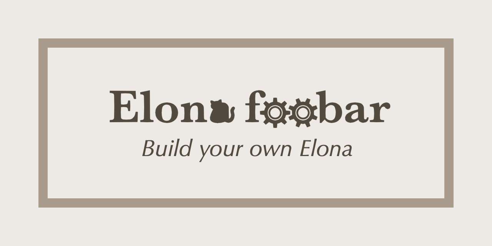

[](https://elonafoobar.com)


[](https://github.com/elonafoobar/elonafoobar/releases/latest)
[](LICENSE.txt)
[](https://github.com/elonafoobar/elonafoobar/actions)
[](https://twitter.com/ElonaFoobar)
[](https://discord.gg/4htdyc2)


# &lt;Elona foobar&gt;

* One of the Elona variants.
* It is made of Rust and Lua.
* It is derived from Elona v1.22.
* It is still in an early stage of development.
* It features high extensibility through a mod system. [####+]
* It can be localized in multiple languages. [####+]
* It works on Windows, Linux and macOS. [####+]

> An Elona variant that has a mod system. With its high extensibility, you can build your own Elona.
>
> \~Ylva Fantasy Encyclopedia\~


# How To Build

## Requirements

* Rust toolchain
* Lua 5.3
* SDL2, SDL2_image, SDL2_ttf and SDL2_mixer

### Additional requirements for Windows

* Visual Studio 2017 x64

### Additional requirements for Linux

* SMPEG
* Timidity++


## Steps

1. Clone this repository or your forked one: `git clone https://github.com/elonafoobar/elonafoobar`
2. Clone submodules as well: `git submodule update --init`
3. Download the original Elona ([download link](http://ylvania.style.coocan.jp/file/elona122.zip)).
4. Extract `elona122.zip` to the `deps` directory, so `deps\elona` exists. This will allow for automatically copying the required assets.
5. Follow the platform-specific instructions below.

### macOS

1. Install the required dependencies.
```
brew install sdl2 sdl2_ttf sdl2_mixer sdl2_image
```
2. `cd path/to/elonafoobar; cargo build`


### Linux

1. Install the required dependencies. For Arch Linux:
```
sudo pacman -S sdl2 sdl2_ttf sdl2_image sdl2_mixer gtk3 smpeg timidity++
```
For systems with `apt`:
```
sudo apt-get install libsdl2-dev libsdl2-image-dev libsdl2-mixer-dev libsdl2-ttf-dev gtk+-3.0 smpeg timidity
```
2. `cd path/to/elonafoobar; cargo build`


### Windows

1. `cd path\to\elonafoobar & cargo build`


# How To Play

1. Copy the `graphic` and `sound` folders from vanilla v1.22 to the directory containing the executable.
2. Execute `target/debug/Elona_foobar`, `target\debug\Elona_foobar.exe`.


# How To Contribute

See [CONTRIBUTING.md](.github/CONTRIBUTING.md) for details.


# License

MIT License. See [LICENSE.txt](LICENSE.txt) for details. This license is applied for the
contents in this repository. Note that images, sounds and fonts are not included.


## Thirdparty libraries

* [inspect.lua](https://github.com/kikito/inspect.lua): see [license file](runtime/data/script/prelude/inspect.lua).
* [LuaFun](https://github.com/luafun/luafun): see [license file](runtime/data/script/prelude/luafun/COPYING.md).
